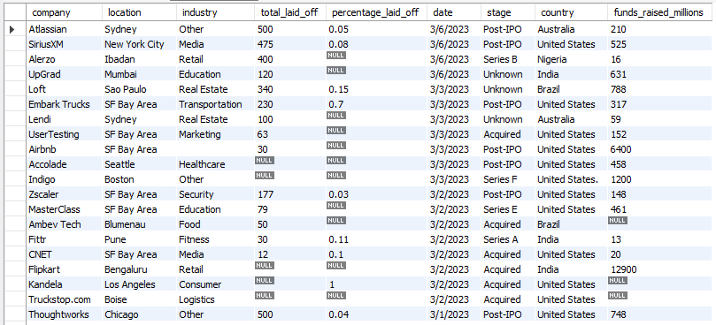
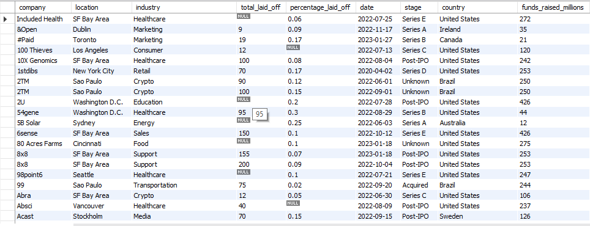

# layoffs-data-cleaning
 SQL project to clean and prepare tech layoffs data for analysis.

Absolutely! Here's a well-structured `README.md` file tailored for your SQL data cleaning project. This format is inspired by best practices observed in similar projects and is designed to effectively showcase your skills to potential employers or collaborators.

---

# 🧹 SQL Data Cleaning Project: Tech Layoffs Dataset

## 📌 Overview

This project focuses on cleaning and preparing a dataset containing information about tech company layoffs. The primary objective was to ensure data quality and consistency, making it suitable for subsequent analysis.

## 🛠️ Tools & Technologies

- **Database**: MySQL
- **Techniques**: CTEs, Window Functions, Joins, Data Type Conversion, String Manipulation 

## 📂 Dataset

- **Source**: A dataset detailing layoffs across various tech companies, including fields like company name, location, industry, total laid off, percentage laid off, date, stage, country, and funds raised.
- **Structure**: The dataset comprises multiple records, each representing a layoff event with the aforementioned attributes.

## 🔍 Data Cleaning Steps

1. **Duplicate Removal**:
   - Utilized `ROW_NUMBER()` to identify duplicate records based on key attributes.
   - Deleted redundant entries, retaining only the first occurrence.

2. **Data Standardization**:
   - Trimmed whitespace from textual fields like company and country names.
   - Standardized industry names (e.g., converting variations of "Crypto" to a uniform format).
   - Removed trailing punctuation from country names.

3. **Date Formatting**:
   - Converted date strings to `DATE` format using `STR_TO_DATE()`.
   - Altered the column data type to ensure proper date handling.

4. **Handling Null and Blank Values**:
   - Replaced blank entries in the industry column with `NULL`.
   - Imputed missing industry values by referencing other records with matching company and location.
   - Removed records lacking both total laid off and percentage laid off data.

5. **Final Touches**:
   - Dropped the temporary `row_num` column used during the deduplication process.
   - Conducted a final review to ensure data integrity and readiness for analysis.

## 📁 Repository Contents

- `layoffs_data_cleaning.sql`: SQL script encompassing all data cleaning operations.
- `README.md`: This documentation file detailing the project's scope and methodologies.

## 📊 Potential Analyses Post-Cleaning

- Trend analysis of layoffs over time.
- Industry-wise impact assessment.
- Geographical distribution of layoffs.
- Correlation between funding stages and layoff frequencies.

## 📈 Future Enhancements

- Integration with visualization tools like Tableau or Power BI for graphical representations.
- Automation of the cleaning process using stored procedures or scripts.
- Expansion of the dataset to include more recent layoff events.

Raw Data:-

Cleaned Data:-

